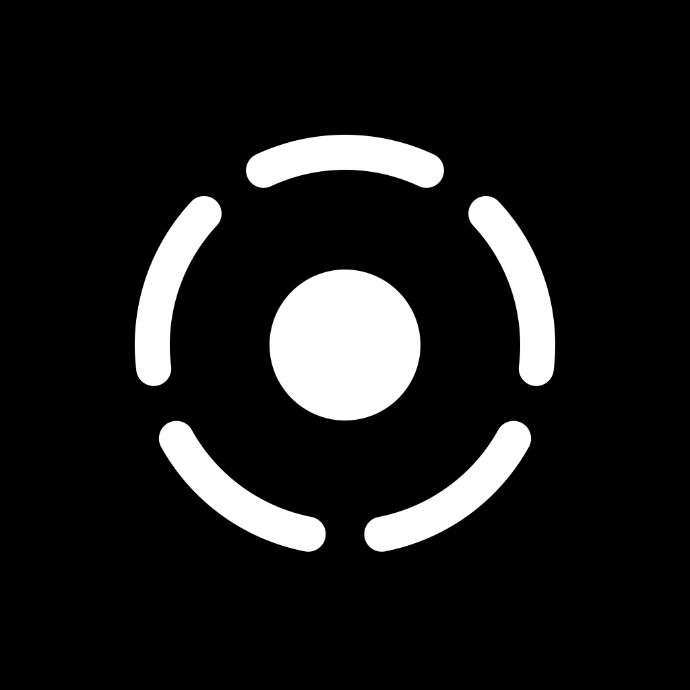

# Holonic Asset

  

  

Holonic Asset brings AI generation into real-world game development workflows. Within a shared project context, creators can generate, iterate on, connect, manage, and export characters, objects, scenes, tilesets, and UI assets instead of ending up with isolated images.

## Who It Is For

Holonic Asset is built for:

- Indie game developers and small game teams
- Prototype developers who need to build game demos quickly
- Pixel art and character design enthusiasts

## Why Holonic Asset

General-purpose image generation tools often fail to address the key challenges of game asset production: assets lack a shared project context, revision history is difficult to track, and generated results still need to be sliced and converted before they can be imported into a game engine.

Holonic Asset organizes asset production into a continuous workflow:

Project setup → Asset generation and management → Continuous iteration → Batch processing → Export and game integration

Project-level visual direction, game genre, perspective, target platform, and reference images form a shared context that helps keep characters, scenes, UI, and objects consistent in style, proportions, and color palette.

## Core Capabilities

- **Project context**: Centrally manage visual direction and generation settings for a game, prototype, or themed asset pack.
- **Multiple asset types**: Support characters, objects, UI, scenes, and tilesets.
- **Continuous creation**: Repeatedly generate, partially redraw, and manually refine the same asset without losing its creative history.
- **Version history**: Create a Record whenever a generation or edit is confirmed, making it possible to review the history and restore any version.
- **Asset relationships and tags**: Track relationships between characters, animations, sound effects, scenes, and other assets while supporting search and batch operations.
- **Production-ready exports**: Export PNG, GIF, spritesheet, tileset, JSON, and other formats according to asset type, with subsequent conversion for game engines such as Unity and Godot.

## Domain Model

### Project

A Project represents a game, game prototype, or consistently themed asset pack. It stores information such as the game genre, visual style, target platform, description, camera perspective, and reference images while providing shared AI context and centralized asset management.

### Asset

An Asset is an independently created, iterated, and deliverable unit within a Project. A character, wooden chest, inventory interface, scene, or background music track can each be an Asset. Every asset type retains the structure it needs, such as character prototypes and animation frames, scene layers, or placeable Items and Tiles within a Tileset.

### Record

A Record is a complete snapshot of an Asset after a creation or edit is confirmed. It makes generation history traceable, comparable, and reversible so users can confidently explore different creative directions.

## Roadmap

The first milestone focuses on completing the core workflow:

- [ ] Web application for asset creation and management
- [ ] Project creation, editing, and global visual configuration
- [ ] Asset creation, search, duplication, editing, and deletion
- [ ] AI regeneration and asset content editing
- [ ] Animation generation from character or object prototypes
